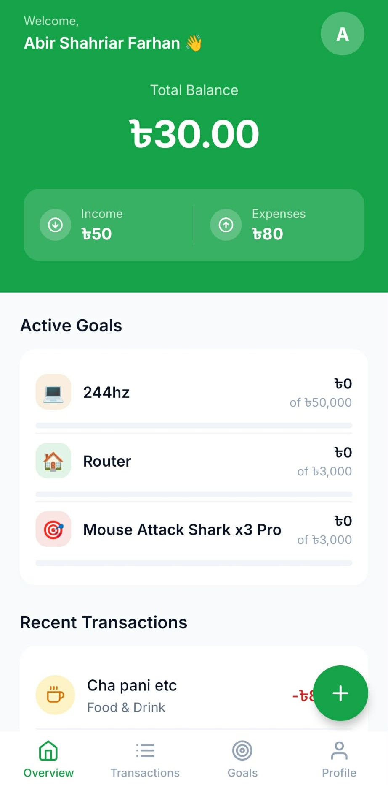
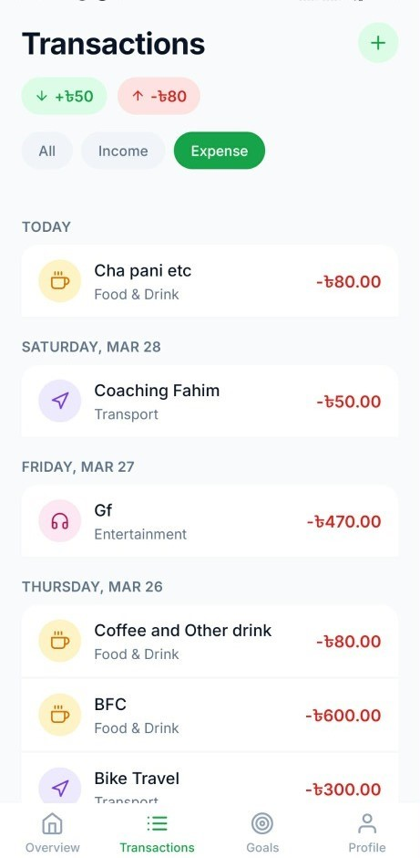

# CashBook 📱

CashBook is a modern, professional financial management mobile application built with React Native and Expo. It empowers users to track their expenses, monitor income, and achieve their savings goals with a premium, intuitive interface.

---

## ✨ Features

- **📊 Comprehensive Financial Tracking**: Easily record income and expenses with detailed categorisation and notes.
- **🎯 Smart Saving Goals**: Set, track, and manage your financial milestones with visual progress indicators.
- **🛡️ Enterprise-Grade Security**: Protect your sensitive financial data with Biometric Authentication (Fingerprint/FaceID).
- **🎨 Dynamic Typography System**: Personalise your experience by switching between 7 premium Google Fonts globally.
- **🖼️ Interactive Onboarding**: A beautiful carousel-based introduction and seamless profile setup for new users.
- **📄 Professional Reporting**: Export your financial statements and transaction history to high-quality PDF files.
- **🧹 Data Management**: Full control over your data with secure "Clear All Data" functionality.
- **🌓 Modern UI/UX**: Built with a sleek, responsive design using Tailwind CSS for a premium feel.

---

## 📸 Screenshots

<p align="center">
  
  
  
</p>

---

## 🛠️ Technology Stack

- **Framework**: [React Native](https://reactnative.dev/) with [Expo](https://expo.dev/)
- **Language**: [TypeScript](https://www.typescriptlang.org/)
- **Navigation**: [Expo Router](https://docs.expo.dev/router/introduction/) (File-based routing)
- **Styling**: [Tailwind CSS](https://tailwindcss.com/) via `twrnc`
- **Database**: [SQLite](https://docs.expo.dev/versions/latest/sdk/sqlite/) (via `expo-sqlite`) for robust local storage
- **State Management**: React Context API
- **Authentication**: `expo-local-authentication`
- **PDF Generation**: `expo-print` & `expo-sharing`

---

## 🚀 Getting Started

Ensure you have [Node.js](https://nodejs.org/) installed on your machine.

### 1. Clone the Repository

```bash
git clone https://github.com/farhanshahriyar/CashBook-App.git
cd CashBook-App
```

### 2. Install Dependencies

```bash
npm install
```

### 3. Start the Development Server

```bash
npx expo start
```

Use the **Expo Go** app on your mobile device to scan the QR code and experience the app!

---

## 📁 Project Structure

```text
├── app/               # Expo Router pages & layouts
│   ├── (tabs)/        # Main application tab screens
│   ├── onboarding/    # New user flow components
│   └── index.tsx      # Entry splash screen
├── assets/            # Static images and custom fonts
├── contexts/          # React Contexts for global state (Finance, User, AppLock, Font)
├── lib/               # Shared utilities, database queries, and constants
│   ├── db/            # SQLite schema and query logic
│   └── tw.ts          # Tailwind CSS configurations
└── components/        # Reusable UI components
```

---

## 📄 License

This project is licensed under the MIT License - see the LICENSE file for details.

---

<p align="center">
  Built by Farhan Shahriyar
</p>
